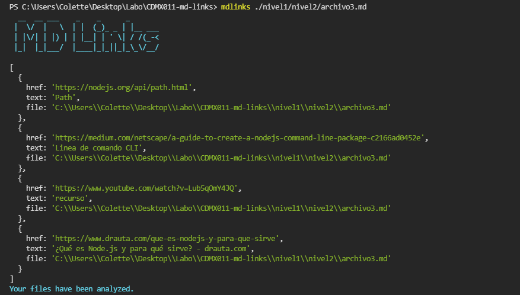
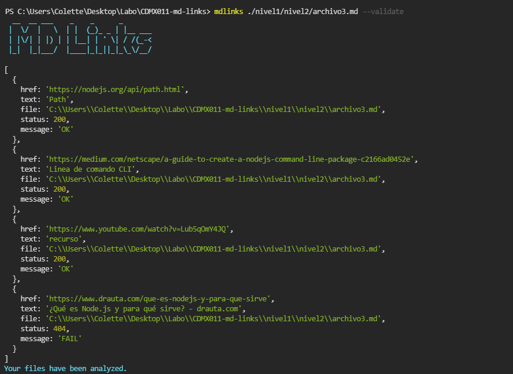
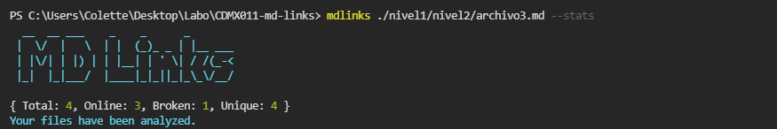
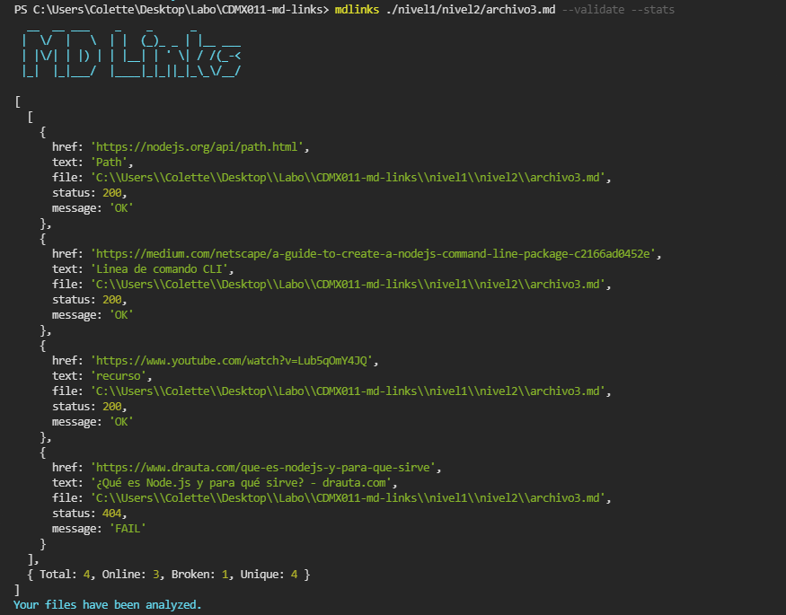

# Markdown Links

## 1. Resumen del proyecto

## ¿Qué es MDLinks?

MDLinks es una librería/módulo basado en promesas para node.js que se ejecuta en el código base. Lee y analiza documentos Markdown usando el módulo axios para las peticiones HTTP, validación de links y obtención de estadísticas básicas, al igual que se ejecuta mediante una línea de comando (CLI).


## Esta librería consta de dos partes

### 1) JavaScript API

#### `mdLinks(path, options)`

##### Argumentos

* `path`: Ruta **absoluta** o **relativa** al **archivo** o **directorio**.

* `options`: Un objeto con **únicamente** la siguiente propiedad:
  - `validate`: Booleano que determina si se desea validar los links
    encontrados.

##### Valor de retorno

La función retorna un arreglo de objetos, donde cada objeto representa un link y contiene las siguientes propiedades

Con `validate:false` :

* `href`: URL encontrada.
* `text`: Texto que aparecía dentro del link (`<a>`).
* `file`: Ruta del archivo donde se encontró el link.

Con `validate:true` :

* `href`: URL encontrada.
* `text`: Texto que aparecía dentro del link (`<a>`).
* `file`: Ruta del archivo donde se encontró el link.
* `status`: Código de respuesta HTTP.
* `ok`: Mensaje `fail` en caso de fallo u `ok` en caso de éxito.

#### Ejemplo (resultados como comentarios)

```js
const mdLinks = require("md-links");

mdLinks("./some/example.md")
  .then(links => {
    // => [{ href, text, file }, ...]
  })
  .catch(console.error);

mdLinks("./some/example.md", { validate: true })
  .then(links => {
    // => [{ href, text, file, status, ok }, ...]
  })
  .catch(console.error);

mdLinks("./some/dir")
  .then(links => {
    // => [{ href, text, file }, ...]
  })
  .catch(console.error);
```

### 2) CLI (Command Line Interface - Interfaz de Línea de Comando)

El ejecutable de nuestra aplicación se ejecuta de la siguiente
manera a través de la **terminal**:

`md-links <path-to-file> [options]`

Por ejemplo:



El comportamiento por defecto no valida las URLs, únicamente identifica el archivo markdown (a partir de la ruta que recibe como
argumento), analiza el archivo Markdown e imprime los links que vaya
encontrando, junto con la ruta del archivo donde aparece y el texto
que hay dentro del link.

#### Options

##### `--validate`

Si pasamos la opción `--validate`, el módulo hace una petición HTTP para
averiguar si el link funciona o no. Si el link resulta en una redirección a una
URL que responde ok, entonces consideraremos el link como ok.

Por ejemplo:



##### `--stats`

Si pasamos la opción `--stats` el output (salida) será un texto con estadísticas
básicas sobre los links.



También podemos combinar `--stats` y `--validate` para obtener estadísticas que
necesiten de los resultados de la validación.



### Dependencias

* Marked
* Axios
* Jest

